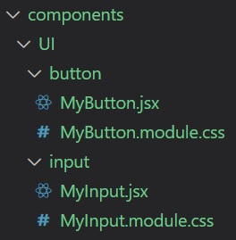
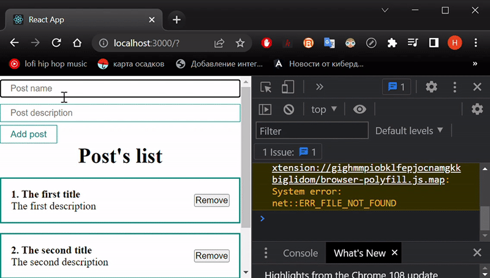

# learnReact
## Day 4 `07/01/2023`

Happy New Year motherfucker...

---

🎄🎄🎄🎆🎆🎆✨✨✨🎇🎇🎇🎄🎄🎄

---
> Well, I've fucked up all day yesterday because of my illness. I couldn't be in a non-lying position. I didn't get any better today. I just do codding in the bed.

## A first UI library

I think it's time to do something more serious. For example, a form control library that needs to create new posts.  
I'll start to develop in `App.js`, and at the end I'll made a decomposition into a new component.

First of all, I need a file structure with the `UI` folder as the `root` directory in the `components`. Look at the picture below 👇👇👇

<div align="center">
  
</div>

Pay attention, every component has own folder and a `stylesheet`. The stylesheet's `name` is written with an `.module` extension.

Then, I'd like to make a simple form with two inputs and a button in `App.js`:

```jsx
<form action="">
  <input type="text" placeholder="Post name" />
  <input type="text" placeholder="Post description" />
  <button>Add post</button>
</form>
```
The next step is the `MyButton` work out. I need some skeleton and styles of course:
<table align="center">
  <tr>
    <th>MyButton.jsx</th>
    <th>MyButton.module.css</th>
  </tr>
  <tr>
  <td valign="top">

  ```jsx
    import React from 'react';
    import classes from './MyButton.module.css';

    const MyButton = (props) => {
      return (
        <button className={classes.myBtn}>
          {props.children}
        </button>
      );
    };

    export default MyButton;
  ```
  </td>

  <td valign="top">

  ```jsx
  .myBtn {
    padding: 5px 15px;
    color: teal;
    font-size: 14px;
    background-color: transparent;
    border: 1px solid teal;
    cursor: pointer;
  }
  ```
  </td>
  </tr>
</table>

Take a look to the `MyButton.jsx	`. I import `styles` as a `property` of the classes `object`, but more on that later. The `{props.children}` is provide a `nested <children> element`.

To make sure there's works I have to change the `button` tag of form  as the `MyButton` in `App.js`.

```jsx
<MyButton>Add post</MyButton>
```

In order to `get` all `props` in `MyButton` I have to change that like this: the `(props)` become the `({children, ...props})`, and the `button` tag get all `props` also.
> All props written like `...props`.

```jsx
const MyButton = ({children, ...props}) => {
  return (
    <button {...props} className={classes.myBtn}>
      {children}
    </button>
  );
};
```
The `MyInput` is created in the same way:
<table align="center">
  <tr>
    <th>MyInput.jsx</th>
    <th>MyInput.module.css</th>
  </tr>
  <tr>
  <td valign="top">

  ```jsx
    import React from 'react';
    import classes from './MyInput.module.css'

    const MyInput = (props) => {
      return (
        <input className={classes.myInput} {...props} />
      );
    });

    export default MyInput;
  ```
  </td>

  <td valign="top">

  ```jsx
  .myInput {
    width: 100%;
    padding: 5px 15px;
    margin: 5px 0;
    border: 1px solid teal;
  }
  ```
  </td>
  </tr>
</table>

And so, the `App.js` form has been changed:
```jsx
<form action="">
  <MyInput type="text" placeholder="Post name" />
  <MyInput type="text" placeholder="Post description" />
  <MyButton>Add post</MyButton>
</form>
```


In order to `add` new `posts` I have to `include` an `event listener` that should call the function `addNewPost` as well as this `function`. There are two ways to do this: a `controlled` component or an `uncontrolled` component.

### Controlled component
I did the same [3 days ago](https://github.com/syrovezhko/learn-react/tree/day_2#controlled-components-and-two-way-bindings-magic). I have to use the state with empty string.

```jsx
const [title, setTitle] = useState('')
const bodyInputRef = useRef();

const addNewPost = (e) => { // `e` is `event`
  e.preventDefault() /* this prevents 
  the button's default event, submit,
  which refreshes the page and submits
  the data */
  console.log(title) // for self-test
}
```
To catch user's input data I have to realize the onChange function as an attribute of MyInput tag: `onChange={event => setTitle(event.target.value)}`. To see that's fine, just log it.
<div align="center">
  
</div>

### Uncontrolled component
The `useRef` hook should help here. It's give the access to the DOM element and theres value.  
I have to add the `ref` props as an attribute and transmit there the `useRef` hyperlink.

```jsx
{/* put it after `useState` */}
const bodyInputRef = useRef();
{/* this is the `useRef` hyperlink👆 */}

{/* the input wil change like👇 */}
<MyInput
  ref={bodyInputRef}
  type="text"
  placeholder="Post description" />
```

In order to use the `useRef` I have to received the data by React.forwardRef. There is [official docs](https://reactjs.org/docs/react-api.html#reactforwardref) about it.  
The `MyInput.jsx` is changed:

```jsx
const MyInput = React.forwardRef((props, ref) => {
  return (
    <input ref={ref} className={classes.myInput} {...props} />
  );
});
```

That's good! But I don't need two different approach in one section. I'll leave the first one, the controlled.

---

That's enough for today, I guess.

---

### [Back to main branch](https://github.com/syrovezhko/learn-react#learnreact)
#### [checkout **Day 3**](https://github.com/syrovezhko/learn-react/tree/day_3#learnreact) | [checkout **Day 5**](https://github.com/syrovezhko/learn-react/tree/day_5#learnreact)
#### [My CV](https://github.com/syrovezhko)