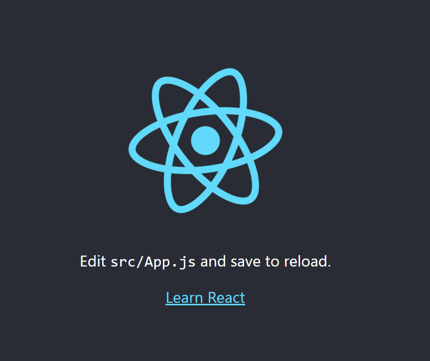

# learnReact
## Day 1 `03/01/2023`

Happy New Year motherfucker...

---

🎄🎄🎄🎆🎆🎆✨✨✨🎇🎇🎇🎄🎄🎄

---

## First project creation
First of all let's check out the official [guide](https://reactjs.org/docs/create-a-new-react-app.html). There are a lot of ways to do this. But I chose the easiest — [Create React App](https://reactjs.org/docs/create-a-new-react-app.html#create-react-app).
> Check your ***node*** and ***npm*** versions before running. They must be [up to date](https://nodejs.org/en/).
Today there are `18.12.1` and `9.2.0` respectively.

I've already created the folder `learn-react` for project. That's why I'll use the short command for start:
```
npx create-react-app .
```

> **ATTENTION!!! Do not use camelCase for folder naming!**

Here we go. The app is created. You may find all the commands you need in the `README.md`

<details><summary>An ordinary README of React is here👈👈👈</summary>

### Getting Started with Create React App

This project was bootstrapped with [Create React App](https://github.com/facebook/create-react-app).

#### Available Scripts

In the project directory, you can run:

##### `npm start`

Runs the app in the development mode.\
Open [http://localhost:3000](http://localhost:3000) to view it in your browser.

The page will reload when you make changes.\
You may also see any lint errors in the console.

##### `npm test`

Launches the test runner in the interactive watch mode.\
See the section about [running tests](https://facebook.github.io/create-react-app/docs/running-tests) for more information.

##### `npm run build`

Builds the app for production to the `build` folder.\
It correctly bundles React in production mode and optimizes the build for the best performance.

The build is minified and the filenames include the hashes.\
Your app is ready to be deployed!

See the section about [deployment](https://facebook.github.io/create-react-app/docs/deployment) for more information.

##### `npm run eject`

**Note: this is a one-way operation. Once you `eject`, you can't go back!**

If you aren't satisfied with the build tool and configuration choices, you can `eject` at any time. This command will remove the single build dependency from your project.

Instead, it will copy all the configuration files and the transitive dependencies (webpack, Babel, ESLint, etc) right into your project so you have full control over them. All of the commands except `eject` will still work, but they will point to the copied scripts so you can tweak them. At this point you're on your own.

You don't have to ever use `eject`. The curated feature set is suitable for small and middle deployments, and you shouldn't feel obligated to use this feature. However we understand that this tool wouldn't be useful if you couldn't customize it when you are ready for it.

#### Learn More

You can learn more in the [Create React App documentation](https://facebook.github.io/create-react-app/docs/getting-started).

To learn React, check out the [React documentation](https://reactjs.org/).

##### Code Splitting

This section has moved here: [https://facebook.github.io/create-react-app/docs/code-splitting](https://facebook.github.io/create-react-app/docs/code-splitting)

##### Analyzing the Bundle Size

This section has moved here: [https://facebook.github.io/create-react-app/docs/analyzing-the-bundle-size](https://facebook.github.io/create-react-app/docs/analyzing-the-bundle-size)

##### Making a Progressive Web App

This section has moved here: [https://facebook.github.io/create-react-app/docs/making-a-progressive-web-app](https://facebook.github.io/create-react-app/docs/making-a-progressive-web-app)

##### Advanced Configuration

This section has moved here: [https://facebook.github.io/create-react-app/docs/advanced-configuration](https://facebook.github.io/create-react-app/docs/advanced-configuration)

##### Deployment

This section has moved here: [https://facebook.github.io/create-react-app/docs/deployment](https://facebook.github.io/create-react-app/docs/deployment)

##### `npm run build` fails to minify

This section has moved here: [https://facebook.github.io/create-react-app/docs/troubleshooting#npm-run-build-fails-to-minify](https://facebook.github.io/create-react-app/docs/troubleshooting#npm-run-build-fails-to-minify)

</details>

###### Well, it's time for first start
Run the command below and your browser should open web page on `localhost:3000`
```
npm start
```

You should see the screen such like this:


### Make some simplicity
Folders of the project have to much files for beginners. All should be removed except ***`index.html`*** from `public` and ***`App.js`*** & ***`index.js`*** from `src`.  

<details><summary> <u>index.html</u> 👈👈👈</summary>

I think it should be better to remove some extra lines from ***`index.html`***, ***`App.js`*** and ***`index.js`*** For example, icons, comments, etc. That data is not necessary for beginners like me.  
Here we go! You may compare your files with mine:

```html
<!DOCTYPE html>
<html lang="en">
  <head>
    <meta charset="utf-8" />
    <meta name="viewport" content="width=device-width, initial-scale=1" />
    <title>React App</title>
  </head>
  <body>
    <noscript>You need to enable JavaScript to run this app.</noscript>
    <div id="root"></div>
  </body>
</html>
```

You can see, now the file looks like standard `html` template with only one `root` block. This block should contain an `app` component:
```html
<div id="root">
    <!-- my APP gonna be here -->
</div>
```
</details>

<details><summary> <u>App.js</u> 👈👈👈</summary>

Here I need the clear template as well. `App()` function only.
> Don't forget to ***`import React from "react";`***!

```js
import React from "react";

function App() {
  return (
    <div className="App">
      
    </div>
  );
}

export default App;

```
</details>

<details><summary> <u>index.js</u> 👈👈👈</summary>

And here I need only 3 components to import: `React core`, `React DOM` and `App`. The last one must be the only one callable in `root` block.

```js
import React from 'react';
import ReactDOM from 'react-dom/client';
import App from './App';

const root = ReactDOM.createRoot(document.getElementById('root'));
root.render(
    <App />
);
```

</details>

---

## A fue words about JSX

Do you remember how to create `HTML` elements via `JavaScript`? What should I write in `index.js`?

```js
ReactDOM.render(
    React.createElement('div', {}
        React.createElement('button', {}, 'TEXT')
    )
)
```
It's too complicated, isn't it? If we need `HTML`, why we can't write `HTML`? 
<div align="center">
    
</div>

**No! We CAN!**
It's called **JSX** or **JavaScript XML**. `JSX` allows us to write HTML in React. You may read about it [here](https://www.w3schools.com/react/react_jsx.asp). let's rewrite the same things using it:

```jsx
ReactDOM.render(
    <div>
        <button>TEXT</button>
    </div>
)
```
<div align="center">
    
</div>

Now you can see, `React` made `JS`-coding a bit relaxing by `JSX`.

---