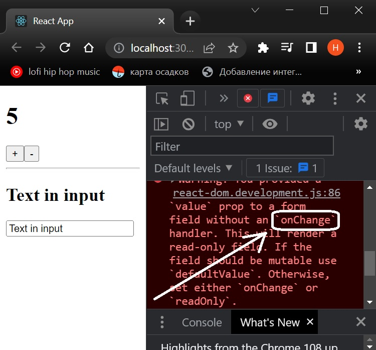
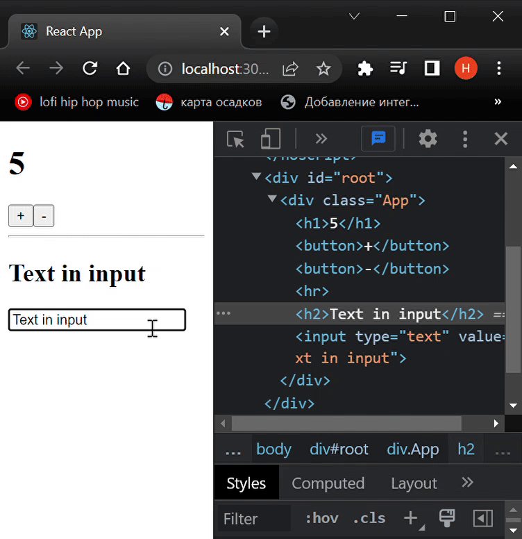
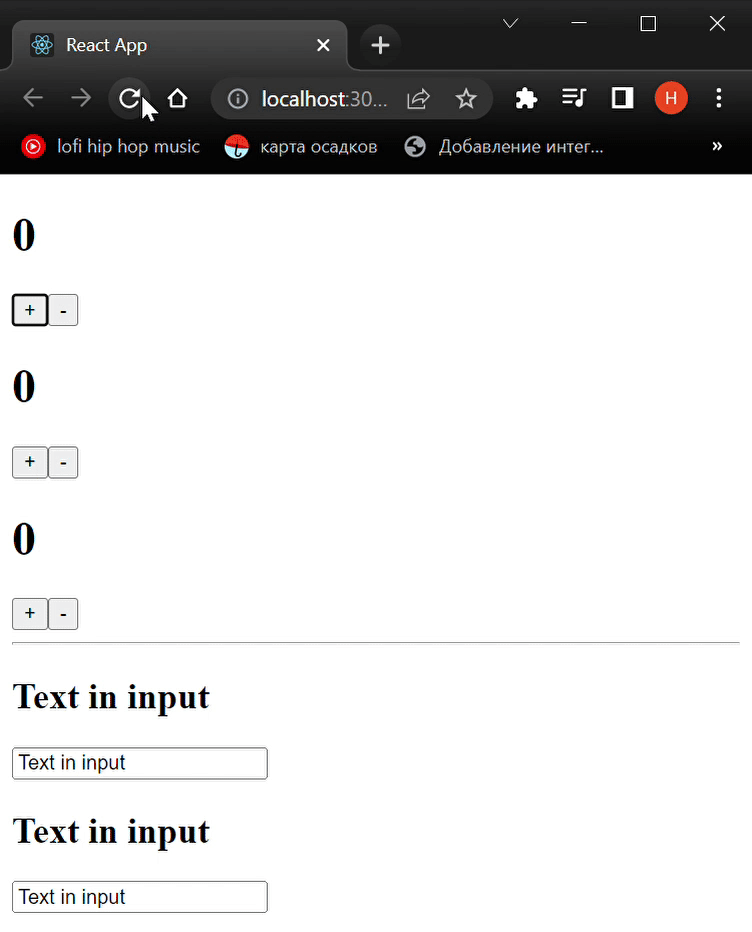

# learnReact
## Day 2 `04/01/2023`

Happy New Year motherfucker...

---

🎄🎄🎄🎆🎆🎆✨✨✨🎇🎇🎇🎄🎄🎄

---
Well it's time to continue yesterday's [party](https://github.com/syrovezhko/learn-react/tree/day_1#learnreact)

## Controlled Components and `two-way bindings` magic
All right, yesterday I've got acquainted the UseState  on the example of `numbers` changing as [simple counter](https://github.com/syrovezhko/learn-react/tree/day_1#back-to-main-branch). Now I want to try changing the `string` type `state`.  
I'll start by adding a new state that will work with input values:

```js
const [value, setValue] = useState('Text in input')
```
I need to add some HTML stuff also.

```jsx
return (
  <div className="App">
    {/* _________________ */}
    {/* the previous "UI" */}
    {/* _________________ */}
    <h1>{likes}</h1>
    <button onClick={increment}>+</button>
    <button onClick={decrement}>-</button>
    {/* ____________ */}
    {/* a new "UI" */}
    {/* ____________ */}
    <hr/>
    <h2>{value}</h2>
    <input
      type="text"
      value={value}>
    </input>
  </div>
);
```
You may try to test this but it won't work. 
The whole point is that I declared the `value` with static `text` without an `onChange` handler.
<div align="center">
    
</div>

It necessary to add the `onChange` event listener as an `attribute` of `input` tag. Of course, as you know, the `event listener` `call back` has the first parameter, an `event`, with two fields: a `target` and a `value`. The DOM element and that element's `value`, simply put. In this case, it is possible to extract the `value` and put it to the `state`. It's called `two-way binding`. Here we go!
```jsx
<input
  type="text"
  value={value}
  onChange={event => setValue(event.target.value)}>
</input>
```

<div align="center">
    
</div>
<details><summary>Now <b><i>App.js</i></b> look like this 👈👈👈<br/><sup>Attention! It's may seem like a long read.</sup></summary>

```jsx
import React, { useState } from "react";

function App() {
  const [likes, setLikes] = useState(5)
  const [value, setValue] = useState('Text in input')

  function increment () {
    setLikes(likes + 1);
  }

  function decrement () {
    setLikes(likes - 1);
  }

  return (
    <div className="App">
      <h1>{likes}</h1>
      <button onClick={increment}>+</button>
      <button onClick={decrement}>-</button>
      <hr/>
      <h2>{value}</h2>
      <input
        type="text"
        value={value}
        onChange={event => setValue(event.target.value)}>
      </input>
    </div>
  );
}

export default App;

```
</details>

## The component approach

It's time to divide this application into modules. However, React has something better - components.

First of all, I should make a new directory `components` in the `src` folder. The first component will be a `Counter.jsx`.

> Pay attention, the `first letter` of the file name is `capital` and the file `extension` is `JSX`.

> Before continue, it's better to install the [Reactjs code snippets](https://marketplace.visualstudio.com/items?itemName=xabikos.ReactSnippets), in the case of using VSCode of course.

You may get the component skeleton by snippet. Just type `rsc` and hit the `Tab` button in `Counter.jsx`.

```jsx
import React from 'react';

const Counter = () => {
    return (
        <div>
            
        </div>
    );
};

export default Counter;
```


You may have noticed the `component` is just a `function` that `returned` some `JSX` data. It could be as `Arrow Function` and `Function Declaration`. Well, let's `move` count's code parts from the `App.js` into the `Counter.jsx`:

```jsx
import React, { useState } from 'react';

const Counter = () => {
  const [likes, setLikes] = useState(0)

  function increment () {
    setLikes(likes + 1);
  }

  function decrement () {
    setLikes(likes - 1);
  }

  return (
    <div>
      <h1>{likes}</h1>
      <button onClick={increment}>+</button>
      <button onClick={decrement}>-</button>
    </div>
  );
};

export default Counter;
```

The App.js will changed like this:

```jsx
import React, { useState } from "react";
import Counter from "./components/Counter";

function App() {

  return (
    <div className="App">
      <Counter/>
    </div>
  );
}

export default App;
```

Try to make all the same for text input component by yourself.

> Don't forget about `imports` `useState` to `both` of `components` and `themselves` into the `App.js`.

<details><summary>Don't peek😉</summary>
<table align="center">
  <tr>
    <th>App.js</th>
    <th>Counter.jsx</th>
    <th>TextInput.jsx</th>
  </tr>
  <tr>
  <td valign="top">

  ```jsx
  import React from "react";
  import Counter from "./components/Counter";
  import TextInput from "./components/TextInput";

  function App() {

    return (
      <div className="App">
        <Counter/>
        <hr/>
        <TextInput/>
      </div>
    );
  }

  export default App;

  ```

  </td>
  <td valign="top">

  ```jsx
  import React, { useState } from 'react';

  const Counter = () => {
    const [likes, setLikes] = useState(0)

    function increment () {
      setLikes(likes + 1);
    }

    function decrement () {
      setLikes(likes - 1);
    }

    return (
      <div>
        <h1>{likes}</h1>
        <button onClick={increment}>+</button>
        <button onClick={decrement}>-</button>
      </div>
    );
  };

  export default Counter;
  ```

  </td>
  <td valign="top">

  ```jsx
  import React, { useState } from 'react';

  const TextInput = () => {
    const [value, setValue] = useState('Text in input')

    return (
      <div>
        <h2>{value}</h2>
        <input
          type="text"
          value={value}
          onChange={event => setValue(event.target.value)}>
        </input>
      </div>
    );
  };

  export default TextInput;
  ```

  </td>
  </tr>
</table>
</details>

###### Note that you can add multiple component instances and each one will work independently.

```jsx
import React from "react";
import Counter from "./components/Counter";
import TextInput from "./components/TextInput";

function App() {

  return (
    <div className="App">
      <Counter/>
      <Counter/>
      <Counter/>
      <hr/>
      <TextInput/>
      <TextInput/>
    </div>
  );
}

export default App;
```
<div align="center">
    
</div>

It demonstrates the `reusability` of `components`. These `components` were only `training`, but they could be arbitrarily `complex`.

## Class Components

This is an old one approach. But somewhere it's using, as far as I know.

In order to get the component skeleton, there is also a snippet. Type `rcc` and hit the `Tab` button in `ClassCounter.jsx` (I hope you'd up to create that one by yourself).

<details><summary>Should look like this 👈👈👈</summary>

```jsx
import React, { Component } from 'react';

class ClassCounter extends Component {
  render() {
    return (
      <div>
        
      </div>
    );
  }
}

export default ClassCounter;
```
</details>
<br/>

You may have noticed here is a `render` function, unlike the functional component, that should `return` a `JSX`. Please keep in mind this is not an object.

We can't use `hokes` here. In order to `set state` a `constructor` is needed:

```jsx
constructor(props) {
  super(props);
  this.state = {
    likes: 0
  }
```
There is the state property that a protected name in components. I needed to add a likes field to it.

To change the `state`, you need to call the `setState` function via context. Functions should be declared like this:
```jsx
increment () {
  this.setState({likes: this.state.likes += 1})
}

decrement () {
  this.setState({likes: this.state.likes -= 1})
}
```
The returnable JSX will be similar, but with the context considering:
```jsx
return (
  <div>
    <h1>{this.state.likes}</h1>
    <button onClick={this.increment}>+</button>
    <button onClick={this.decrement}>-</button>
  </div>
)
```

Alright, just import this at App.js and... it doesn't work. I've forgot to bind the context with button functions. Put the code written down below to the `constructor` after the `state` property:

```jsx
this.increment = this.increment.bind(this);
this.decrement = this.decrement.bind(this);
```
Yippee! It's work again!
<div align="center">
    
</div>

---

That's enough for today, I guess.

---

### [Back to main branch](https://github.com/syrovezhko/learn-react#learnreact)
#### [checkout **Day 1**](https://github.com/syrovezhko/learn-react/tree/day_1#learnreact) | [checkout **Day 3**](https://github.com/syrovezhko/learn-react/tree/day_3#learnreact)
#### [My CV](https://github.com/syrovezhko)
