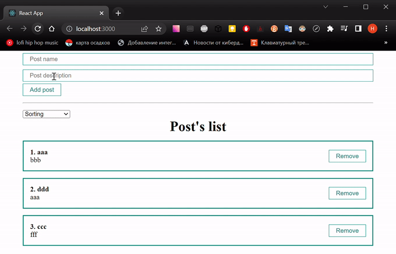
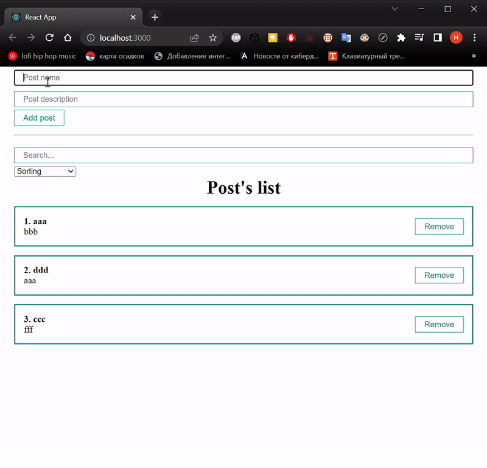

# learnReact
## Day 6 `09/01/2023`

Happy New Year motherfucker...

---

🎄🎄🎄🎆🎆🎆✨✨✨🎇🎇🎇🎄🎄🎄

---
> The doctor visited me today. Rapid tests for COVID-19 and influenza a/b were negative. He has me on antibiotics and has told not to go to the work for a week.  
But fortunately, nobody pay me for studying and I just keep coding in bed😉

## A Sorting

All right, today I'm going to realized a `sorting` and a `searching` for the list of posts. I need a couple of selected options for post's title and description. I'll just add it to `App` after `PostForm`:

```jsx
<hr style={{margin: '15px 0'}} />
<div>
  <select>
    <option value="value1">By name</option>
    <option value="value2">By description</option>
  </select>
</div>
```

Not bad. But as an individual component is better.  
It's look like a UI component. That's why I make a `select` folder in `/src/components/UI` with `MySelect.jsx` inside.

It must accept an options of array and a default value. The default should display a title of selection like `Sorting`. And to display a result I have to iterate over the array by map function and render each iterated option.  
The `option` that option contains the `defaultValue` should be `disabled`, because it's like a heading.

<details><summary>My <b><i>MySelect.jsx</i></b> look like this 👈👈👈</summary>

```jsx
import React from 'react';

// it's accept an options of array and a default value
const MySelect = ({options, defaultValue}) => {
  return (
    <select>
      <option disabled value="">{defaultValue}</option>
{/* iterate over the array by map function */}
      {options.map(option =>
      // and render each iterated option
// key={option.value} because each select's value is unique
        <option key={option.value} value={option.value}>
          {option.name}
        </option>
      )}
    </select>
  );
};

export default MySelect;
```
</details>
<br/>

In `App` I have to import `MySelect` and transmit a defaultValue and options like title and description. Feat it instead of ```<select>...</select>```:
```jsx
<MySelect 
  defaultValue="Sorting"
  options={[
    {value: 'title', name: 'By title'},
    {value: 'body', name: 'By description'}
  ]}/>
```
### Sorting logic

It's time to make a `two-way binding` and make that component controlled. It's nessisarry to accept a `value` and `onChange` function to `watch` the `changes` of `select` by `props` in `select` tag. `onChange` will accept the user's target value:
```jsx
/*  In order to realize a two-way binding and to make the 
    Controlled component, I have to add tho more props*/
const MySelect = ({options, defaultValue, value, onChange}) => {
  return (
    <select
      value={value}
      onChange={event => onChange(event.target.value)}>
      <option disabled value="">{defaultValue}</option>
      {/* nothing changed below */}
      ...)}
```
Back to `App` and make a state for `two-way binding`. `MySelect` will transmit that `value` and a `sorted array` of posts as a `function's` result in `onChage`. The `sorting function` will return a `mutated` post's `array` as a copy one that sorted by `localeCompare()` via `callBack`. In order to see the sorting I have to change the posts array.

<details><summary>Now <b><i>App.js</i></b> look like this 👈👈👈</summary>

```jsx
import React from "react";
import PostList from "./components/PostList";
import './styles/App.css'
import { useState } from "react";
import PostForm from "./components/PostForm";
import MySelect from "./components/UI/select/MySelect";

function App() {
  const [posts, setPosts] = useState([
    {id: 1, title: 'aaa', body: 'bbb'},
    {id: 2, title: 'ddd', body: 'aaa'},
    {id: 3, title: 'ccc', body: 'fff'},
  ])

  // the state for two-way binding of sorting
  const [selectedSort, setSelectedSort] = useState('')

  const createPost = (newPost) => {
    setPosts([...posts, newPost])
  }

  const removePost = (post) => {
    setPosts(posts.filter(p => p.id !== post.id))
  }

  // a sorting function
  const sortPosts = (sort) => {
    setSelectedSort(sort)
    setPosts([...posts].sort((a, b) => a[sort].localeCompare(b[sort])))
  }

  return (
    <div className="App">
      <PostForm create={createPost} />
      <hr style={{margin: '15px 0'}} />
      <div>
        <MySelect
          value={selectedSort}
          onChange={sortPosts}
          defaultValue="Sorting"
          options={[
            {value: 'title', name: 'By title'},
            {value: 'body', name: 'By description'}
          ]}/>
      </div>
      {posts.length !== 0
        ? <PostList
            remove={removePost}
            posts={posts}
            title="Post's list" />
        : <h1
            style={{textAlign: 'center'}}>
              There are no posts here yet
          </h1>
      }
  </div>
  );
}

export default App;
```
</details>
<br/>

And it works!
<div align="center">
  
</div>

## A Searching
`MyInput` is suitable to realize a searching `input` field. That `input` must be `controlled`. `MyInput` will transmit the `state's` value as a `value` and that `target` as an `onChange` props.

```jsx

<MyInput
  value={searchQuery}
  onChange={e => setSearchQuery(e.target.value)}
  placeholder="Search..."/>
```

To get sorted list I have to make one more array's copy. It's too inefficient. I have to `refactor` the previous `function` by save the `sorting`'s result as a `constant` and add a new one.
<details><summary>Now <b><i>App.js</i></b> look like this 👈👈👈</summary>

```jsx
import React from "react";
import PostList from "./components/PostList";
import './styles/App.css'
import { useState } from "react";
import PostForm from "./components/PostForm";
import MySelect from "./components/UI/select/MySelect";
import MyInput from "./components/UI/input/MyInput";

function App() {
  const [posts, setPosts] = useState([
    {id: 1, title: 'aaa', body: 'bbb'},
    {id: 2, title: 'ddd', body: 'aaa'},
    {id: 3, title: 'ccc', body: 'fff'},
  ])

  // the state for two-way binding of sorting
  const [selectedSort, setSelectedSort] = useState('')
  // the state for search queries
  const [searchQuery, setSearchQuery] = useState('')

  function getSortedPosts() {
    console.log('getSortedPosts has been called')
    if (selectedSort) {
      return [...posts].sort((a, b) => a[selectedSort].localeCompare(b[selectedSort]))
    }
    return posts;
  }

  const sortedPosts = getSortedPosts()

  const createPost = (newPost) => {
    setPosts([...posts, newPost])
  }

  const removePost = (post) => {
    setPosts(posts.filter(p => p.id !== post.id))
  }

  // a sorting function
  const sortPosts = (sort) => {
    console.log('sortPosts has been call')
    setSelectedSort(sort)
  }

  return (
    <div className="App">
      <PostForm create={createPost} />
      <hr style={{margin: '15px 0'}} />
      <div>
        <MyInput
          value={searchQuery}
          onChange={e => setSearchQuery(e.target.value)}
          placeholder="Search..."/>
        <MySelect
          value={selectedSort}
          onChange={sortPosts}
          defaultValue="Sorting"
          options={[
            {value: 'title', name: 'By title'},
            {value: 'body', name: 'By description'}
          ]}/>
      </div>
      {posts.length !== 0
        ? <PostList
            remove={removePost}
            posts={sortedPosts}
            title="Post's list" />
        : <h1
            style={{textAlign: 'center'}}>
              There are no posts here yet
          </h1>
      }
  </div>
  );
}

export default App;
```
</details>
<br/>

That looks fine, but it's sorted the `array` and `rerendered` DOM on any change. This can slow down the app. `useMemo` hook may fix it. You may read about it [here](https://beta.reactjs.org/reference/react/useMemo#usememo).

This will replace `getSortedPosts` like this:
```jsx
const sortedPosts = useMemo(() => {
  console.log('useMemo has been called')
  if (selectedSort) {
    return [...posts].sort((a, b) => a[selectedSort].localeCompare(b[selectedSort]))
  }
  return posts;
}, [selectedSort, posts])
```
Now, `sortedPosts`array contains a sorted data and I can use it for search. I'll use the search query with sorted array on filtered titles in `useMemo`:
```jsx
const sortedAndSearchedPosts = useMemo(() => {
  //        here I expect capital letters in titles👇👇👇
  return sortedPosts.filter(post => post.title.toLowerCase().includes(searchQuery))
}, [searchQuery, sortedPosts])
```

In order to `render` `search` result I have to transmit `sortedAndSearchedPosts` as a `PostList` props instead of `sortedPosts`. I like it!
<div align="center">
  
</div>

## Filter refactoring

It's look like a new component! I've moved `selection`'s and `filter`'s JSX from `App` to `PostFilter.jsx` with some `props` changing.

<details><summary>My <b><i>PostFilter.jsx</i></b> look like this 👈👈👈</summary>

```jsx
import React from 'react';
import MySelect from './UI/select/MySelect';
import MyInput from './UI/input/MyInput';

const PostFilter = ({filter, setFilter}) => {
  return (
    <div>
      <MyInput
        value={filter.query}
        onChange={e => setFilter({...filter, query: e.target.value})}
        placeholder="Search..."/>
      <MySelect
        value={filter.sort}
        onChange={selctedSort => setFilter({...filter, sort: selctedSort})}
        defaultValue="Sorting"
        options={[
          {value: 'title', name: 'By title'},
          {value: 'body', name: 'By description'}
        ]}/>
    </div>
  );
};

export default PostFilter;
```
</details>
<br/>

To make it warks I have to replace tho states by new one:
```jsx
/* it was
const [selectedSort, setSelectedSort] = useState('')
const [searchQuery, setSearchQuery] = useState('') */

// it became
const [filter, setFilter] = useState({sort: '', query: ''})
```
Hooks will changed like that:
```jsx
const sortedPosts = useMemo(() => {
    console.log('useMemo has been called')
    if (filter.sort) {
      return [...posts].sort((a, b) => a[filter.sort].localeCompare(b[filter.sort]))
    }
    return posts;
  }, [filter.sort, posts])

  // make a search based on sorted array of posts
  const sortedAndSearchedPosts = useMemo(() => {
    return sortedPosts.filter(post => post.title.toLowerCase().includes(filter.query))
  }, [filter.query, sortedPosts])
```

The `sortPosts` function is not needed any more.

To finish it i have to `transmit` the `filter`'s state to `PostFilter` and refactor that. 

<details><summary>Finally, <b><i>App</i></b> and <b><i>PostFilter</i></b> look like this 👈👈👈</summary>

<table align="center">
  <tr>
    <th>App</th>
    <th>PostFilter</th>
  </tr>
  <tr>
  <td valign="top">

  ```jsx
import React from "react";
import PostList from "./components/PostList";
import './styles/App.css'
import { useState } from "react";
import PostForm from "./components/PostForm";
import { useMemo } from "react";
import PostFilter from "./components/PostFilter";

function App() {
  const [posts, setPosts] = useState([
    {id: 1, title: 'aaa', body: 'bbb'},
    {id: 2, title: 'ddd', body: 'aaa'},
    {id: 3, title: 'ccc', body: 'fff'},
  ])

  // replaced selectedSort and searchQuery
  const [filter, setFilter] = useState({sort: '', query: ''})

  // optimized getSortedPosts by cash of useMemo hook
  const sortedPosts = useMemo(() => {
    console.log('useMemo has been called')
    if (filter.sort) {
      return [...posts].sort((a, b) => a[filter.sort].localeCompare(b[filter.sort]))
    }
    return posts;
  }, [filter.sort, posts])

  // make a search based on sorted array of posts
  const sortedAndSearchedPosts = useMemo(() => {
    return sortedPosts.filter(post => post.title.toLowerCase().includes(filter.query))
  }, [filter.query, sortedPosts])

  const createPost = (newPost) => {
    setPosts([...posts, newPost])
  }

  const removePost = (post) => {
    setPosts(posts.filter(p => p.id !== post.id))
  }

  return (
    <div className="App">
      <PostForm create={createPost} />
      <hr style={{margin: '15px 0'}} />
      <PostFilter
        filter={filter}
        setFilter={setFilter}/>
      <PostList
        remove={removePost}
        posts={sortedAndSearchedPosts}
        title="Post's list" />
  </div>
  );
}

export default App;
  ```
  </td>

  <td valign="top">

  ```jsx
import React from 'react';
import MySelect from './UI/select/MySelect';
import MyInput from './UI/input/MyInput';

const PostFilter = ({filter, setFilter}) => {
  return (
    <div>
      <MyInput
        value={filter.query}
        onChange={e => setFilter({...filter, query: e.target.value})}
        placeholder="Search..."/>
      <MySelect
        value={filter.sort}
        onChange={selctedSort => setFilter({...filter, sort: selctedSort})}
        defaultValue="Sorting"
        options={[
          {value: 'title', name: 'By title'},
          {value: 'body', name: 'By description'}
        ]}/>
    </div>
  );
};

export default PostFilter;
  ```
  </td>
  </tr>
</table>
</details>

---

That's enough for today, I guess.

---

### [Back to main branch](https://github.com/syrovezhko/learn-react#learnreact)
#### [checkout **Day 5**](https://github.com/syrovezhko/learn-react/tree/day_5#learnreact) | [checkout **Day 7**](https://github.com/syrovezhko/learn-react/tree/day_7#learnreact)
#### [My CV](https://github.com/syrovezhko)