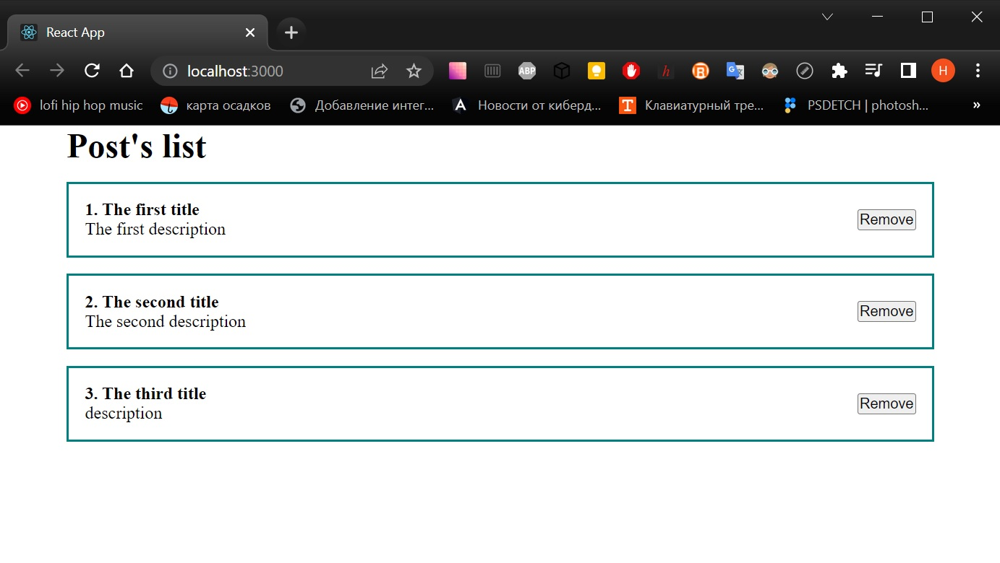

# learnReact
## Day 3 `05/01/2023`

Happy New Year motherfucker...

---

🎄🎄🎄🎆🎆🎆✨✨✨🎇🎇🎇🎄🎄🎄

---
>I think I'm sick. I have a temperature of 37.2°C (98.6°F), a sore throat and a runny nose. It's just a cold, I hope. I'll know more in a week or so.😉 The worst thing is that the brain works too slowly...  
Well, it's time to stop complaining like a little girl and keep learning.

## CSS styles in React
Before we start, it's better to create a new `PostItem.jsx` component:
```jsx
import React from 'react';

const PostItem = () => {
  return (
    <div className="post">
      <div className="post__connect">
        <strong>1. JavaScript</strong>
        <div>
          JavaScript is the programming language.
        </div>
      </div>
      <div className="post__btns">
        <button>Remove</button>
      </div>
    </div>
  );
};

export default PostItem;
```

Take a note, instead of `class` I used the `className` attribute because the first one is a protected name in Javascript.

In order to include `styles` I have to add a `styles` directory to the `src` folder and put inside an `App.css`. Don't forget to import both new files in the `App.js` before the function like this:
```jsx
import PostItem from "./components/PostItem";
import './styles/App.css'
```
<details><summary>I've put my <b><i>App.css</i></b> here 👈👈👈<br/><sup>It's too simple. But you could do it yourself, maybe.</sup></summary>

```css
* {
  margin: 0;
  padding: 0;
  box-sizing: border-box;
}

#root {
  display: flex;
  justify-content: center;
}

.App {
  width: 800px;
}

.post {
  display: flex;
  padding: 15px;
  border: 2px solid teal;
  margin-top: 15px;
  justify-content: space-between;
  align-items: center;
}
```

</details>

You can see this is not so complicated. Like a vanilla JS project.

## Props or object arguments

Long story short, this will make the component templated. The [official guide](https://reactjs.org/docs/components-and-props.html) contains everything you need. Here I'm going to try to make the same with my own component.

This component is static now. It can take input data that are called `props`. In case to take it I have to point it as an `argument` at component's `function`:

```jsx
import React from 'react';

const PostItem = (props) => {...} 
/* I don't want to write the full
component here */
```
To transmit some data, an ID, a title or body for example, I have to point they as `attributes` at component's `tag` in `App.js`:

```jsx
<PostItem
  id={"1"}
  title={"The first title"}
  body={"Description"} />
// or
<PostItem
  post={{
    id: 1,
    title: 'The first title',
    body: 'Description'
  }} />
// I liked the last one so much more.'
```
Since `props` is an `object` and that one named as `post` has a `content` like `id`, `title` and `body`, I can take and use the data in the component like `{props.post.id}`.

<details><summary>The updated <b><i>PostItem.jsx</i></b> is here 👈👈👈</summary>

```jsx
import React from 'react';

const PostItem = (props) => {
  return (
    <div className="post">
      <div className="post__connect">
        <strong>{props.post.id}. {props.post.title}</strong>
        <div>
          {props.post.body}
        </div>
      </div>
      <div className="post__btns">
        <button>Remove</button>
      </div>
    </div>
  );
};

export default PostItem;
```
</details>

## Lists, keys and transforming arrays
This will generate the list of components. Just as in the previous section, the [official guide](https://reactjs.org/docs/lists-and-keys.html) contains everything you need.

First of all, I need a new component, a `PostList.jsx`. It should contain a `heading` and a `map` function that will help to `transform` an `array` of props. The `array` of objects with the data I'll put into `App.js` as a state:

```jsx
const [posts, setPosts] = useState([
  {id: 1, title: 'The first title', body: 'The first description'},
  {id: 2, title: 'The second title', body: 'The second description'},
  {id: 3, title: 'The third title', body: 'The third description'},
])
```

The `PostList.jsx` will look like this:
```jsx
import React from 'react';
import PostItem from './PostItem';

const PostList = (posts, title) => {
  return (
    <div>
      <h1 >
        {title}
      </h1>
      {posts.map((post) =>
        <PostItem
          post={post}
          key={post.id} />
      )}
    </div>
  );
};

export default PostList;

```

> Take a look to the `key` attribute. `Keys` help `React` identify which `items` have `changed`, are `added`, or are `removed`. `Keys` should be `given` to the `elements` `inside the array` to give the elements a `stable` identity, because the index of array can be changed but not an ID.

<div align="center">
  
</div>

<details><summary>The updated <b><i>App.js</i></b> is here 👈👈👈</summary>

```jsx
import React from "react";
import PostList from "./components/PostList";
import './styles/App.css'
import { useState } from "react";

function App() {
  const [posts, setPosts] = useState([
    {id: 1, title: 'The first title', body: 'The first description'},
    {id: 2, title: 'The second title', body: 'The second description'},
    {id: 3, title: 'The third title', body: 'description'},
  ])

  return (
    <div className="App">
      <PostList
        posts={posts}
        title="Post's list" />
  </div>
  );
}

export default App;
```
</details>

## Inline Styling
There are many ways to style React with CSS. Today I used the [CSS stylesheet](#css-styles-in-react). It's time to look at inline styling.

To make it work I have to pass an `object` through the `style` attribute. The key-value pair should look like this: `textAlign: 'center'`. Pay attention, the style's property in CamelCase.
```jsx
<h1 style={{textAlign: 'center'}}>{title}</h1>
```

You may learn more [here](https://www.w3schools.com/react/react_css.asp).


---

That's enough for today, I guess.

---

### [Back to main branch](https://github.com/syrovezhko/learn-react#learnreact)
#### [checkout **Day 2**](https://github.com/syrovezhko/learn-react/tree/day_2#learnreact) | [checkout **Day 4**](https://github.com/syrovezhko/learn-react/tree/day_4#learnreact)
#### [My CV](https://github.com/syrovezhko)
