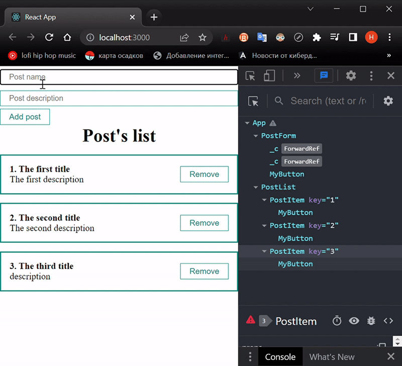

# learnReact
## Day 5 `08/01/2023`

Happy New Year motherfucker...

---

🎄🎄🎄🎆🎆🎆✨✨✨🎇🎇🎇🎄🎄🎄

---
> This day is the last of the New Year holidays. You can envy Russians if you are not. Every winter we have got a vacation of 10 days or so. But I just keep coding in bed with a cold.

## CallBack from the ***form*** component to ***App***
I started the UI yesterday. Today I will begin with the decomposition.  
I have to make a `PostForm.jsx` in the `component`'s folder and past there the `form` from the `App.js` as a `root` tag. The state should be moved also. 
> Don't forget to add `PostForm` to the `App.js`!

Now, it's time to talk about the data exchanged between components.  
We've already used props but haven't discussed it. There are some properties/arguments/parameters that components could take from outside. 
However, the exchange can be from parent to children only.

It worked yesterday. But today, if the PostForm component have to create a new post, it should  transmit that up to App.js, which is the parent, to add that to the posts array. And so, that is impossible. Still, I can add a [callback](https://en.wikipedia.org/wiki/Callback_(computer_programming)) function to `App` that will `wait` the post and than will `push` it to the `array`. To provide this, all I need is to `call` the function `from` the `child`.

Well, I can move `addNewPost` function to `PostForm` component. I have not access to `setPost` state. I'll swap it to a `newPost` which should contain the same object inside.

<details><summary>Now, <b><i>App.js</i></b> and <b><i>PostForm.jsx</i></b> look like this 👈👈👈</summary>
<table align="center">
  <tr>
    <th>App.js</th>
    <th>PostForm.jsx</th>
  </tr>
  <tr>
  <td valign="top">

  ```jsx
import React from "react";
import PostList from "./components/PostList";
import './styles/App.css'
import { useState } from "react";
import PostForm from "./components/PostForm";

function App() {
  const [posts, setPosts] = useState([
    {id: 1, title: 'The first title', body: 'The first description'},
    {id: 2, title: 'The second title', body: 'The second description'},
    {id: 3, title: 'The third title', body: 'description'},
  ])
  // the callBack function
  const createPost = (newPost) => {
    // array update
    setPosts([...posts, newPost])
  }

  return (
    <div className="App">
      {/* call callBack 👇👇👇 */}
      <PostForm create={createPost} />
      <PostList
        posts={posts}
        title="Post's list" />
  </div>
  );
}

export default App;
  ```
  </td>

  <td valign="top">

  ```jsx
import React from 'react';
import { useState } from "react";
import MyButton from "./UI/button/MyButton";
import MyInput from "./UI/input/MyInput";

// callBack call 👇👇👇
const PostForm = ({create}) => {
  const [post, setPost] = useState({title: '', body: ''})

  const addNewPost = (e) => {
    e.preventDefault()
    // that swap👇👇👇
    const newPost = {
      ...post, id: Date.now()
    }
    // callBack transmission👇👇👇
    create(newPost)
    setPost({title: '', body: ''})
  }

  return (
    <form action="">
      <MyInput
        value={post.title}
        onChange={event => setPost({...post, title: event.target.value})}
        type="text"
        placeholder="Post name" />
      <MyInput
        value={post.body}
        onChange={event => setPost({...post, body: event.target.value})}
        type="text"
        placeholder="Post description" />
      <MyButton onClick={addNewPost} >Add post</MyButton>
    </form>
  );
};

export default PostForm;
  ```
  </td>
  </tr>
</table>
</details>
<br/>
It's still working😉
<br/>
<div align="center">
  
</div>

## Removing a post

To realize this function I'm going to make the same `callback` but for `PostItem` through the `PostList` component. It'd look like this:

```jsx
/* this should transmitted from PostItom
                   👇👇👇 */
const removePost = (post) => {
/*  if the array item id equal to the post id,
    it will be removed */
  setPosts(posts.filter(p => p.id !== post.id))
}
```
The function should be transmitted as a `props` from `App`
```jsx
<PostList
  // like this 👇👇👇
  remove={removePost}
  posts={posts}
  title="Post's list" />
```
<details><summary>The <b><i>PostList</i></b> component must accept the data and redirect it to <b><i>PostItem</i></b>.</summary>

```jsx
// here is a remove props acceptation 👇
const PostList = ({posts, title, remove}) => {
  return (
    <div>
      <h1 style={{textAlign: 'center'}}>
        {title}
      </h1>
      {posts.map((post, index) => 
        <PostItem
/* here is a remove props transmission 
              👇👇👇 */
          remove={remove}
          number={index + 1}
          post={post}
          key={post.id} />
      )}
    </div>
  );
};

export default PostList;
```
</details>
<br/>
Finally, I have to accept the props in PostItem and call the function on button click through the PostList.
> And of course, the `button` tag is better to replace for `MyButton`. Not for nothing that I did it yesterday.

<details><summary>Now <b><i>PostItem.jsx</i></b> look like this 👈👈👈</summary>

```jsx
import React from 'react';
import MyButton from './UI/button/MyButton';

const PostItem = (props) => {
  return (
    <div className="post">
      <div className="post__connect">
        <strong>
          {props.number +'. '}
          {props.post.title}
        </strong>
        <div>
          {props.post.body}
        </div>
      </div>
      <div className="post__btns">
        <MyButton
          onClick={
            () => props.remove(props.post)
          }>
            Remove
        </MyButton>
      </div>
    </div>
  );
};

export default PostItem;
```
</details>
<br/>
<div align="center">
  
</div>

---

That's enough for today, I guess.

---

### [Back to main branch](https://github.com/syrovezhko/learn-react#learnreact)
#### [checkout **Day 4**](https://github.com/syrovezhko/learn-react/tree/day_4#learnreact) | [checkout **Day 6**](https://github.com/syrovezhko/learn-react/tree/day_6#learnreact)
#### [My CV](https://github.com/syrovezhko)